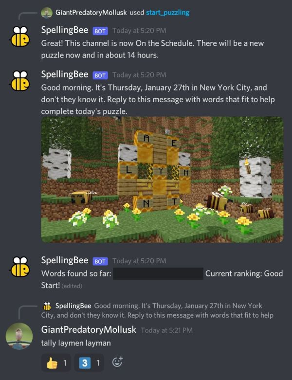

# Spelling Bee Bot

This is a Discord bot that allows you to play the New York Times Spelling Bee with your friends on a Discord server! Click [here](https://discord.com/api/oauth2/authorize?client_id=936097636153425981&permissions=274877958208&scope=applications.commands%20bot) to add it to a server that you own.

Every day, this bot will post the New York Times Spelling Bee puzzle at a time that you specify. You and your friends can reply to the puzzle with words that fit; the bot will react to accepted words and keep a running tally of the words that you’ve found and the ranking you have achieved thereby.

I am not affliated with the New York Times 😔.

## Usage:

 - `/start_puzzling`: retrieves a puzzle and lets you set a time for daily posts.
 - `/stop_puzzling`: ceases daily posts in the server.
 - `/obtain_hint`: gives you a version of the official hint chart with clues to the words that you haven’t found yet.
 - `/explain_rules`: gives you a complete rundown of the rules of the Spelling Bee.
 - `/help`: explains the slash commands
